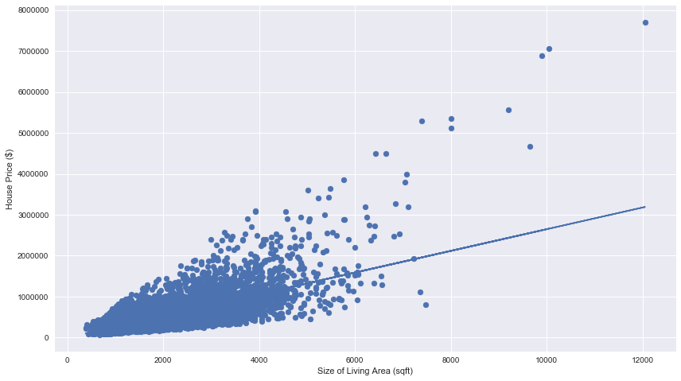
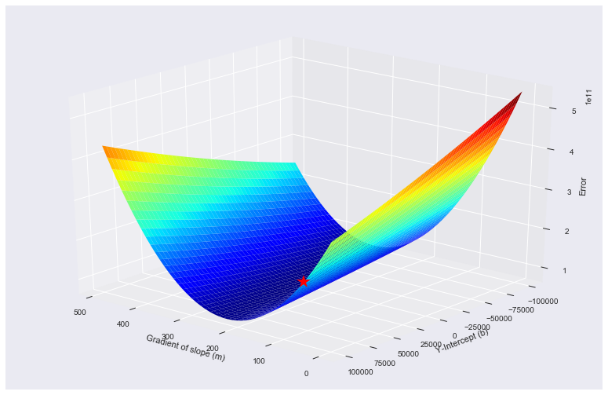
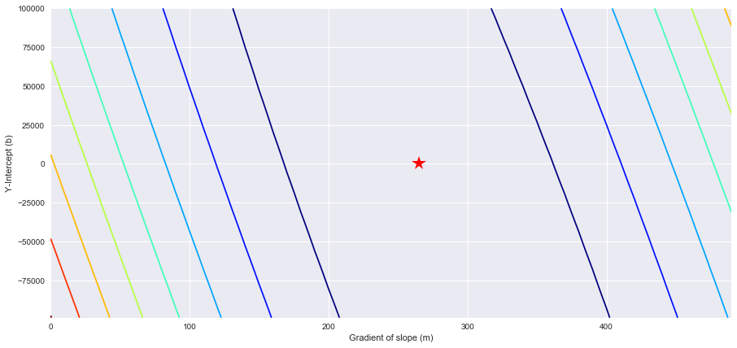
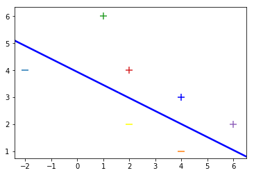

# Gradient Descent with Linear Regression and SVM
An implementation of gradient descent with linear regression and support vector machine in numpy.

## Requirements
* python3
* numpy
* pandas
* matplotlib
* mpl_toolkits
* seaborn

## Usage
Run `jupyter notebook` in your Python 3 environment

## References
1. [Intro to Marth of Intelligence](https://github.com/llSourcell/Intro_to_the_Math_of_intelligence) by Siraj Raval
2. [Visualizing and Animating Optimization Algorithms with Matplotlib](http://louistiao.me/posts/notebooks/visualizing-and-animating-optimization-algorithms-with-matplotlib/) by Louis Tiao
3. [Gradient Descent Examples](https://github.com/mattnedrich/GradientDescentExample) by Matt Nedrich
4. [Classifying Data Using a Support Vector Machine](https://github.com/llSourcell/Classifying_Data_Using_a_Support_Vector_Machine) by Siraj Raval
5. [SVM](https://github.com/MaviccPRP/svm) by MaviccPRP

# Linear Regression

## Introduction
Using the [House Sales in King County, USA](https://www.kaggle.com/harlfoxem/housesalesprediction) dataset from Kaggle, our goal is to build a model using linear regression with gradient descent to predict housing prices given the size of living space in sqft. We then use matplotlib to visualise the gradient contour and the plot of our best-fit line in relation to data points.

## Visualisations From the Notebook
### Plot of Best-Fit Line with Datapoints

### 3D Surface Gradient

### 2D Contour Plot

# Support Vector Machine

## Introduction
This is just a basic implementation of SVM with reference to Siraj's Video, using a toy dataset that can be easily visualised on a 2D plane.

