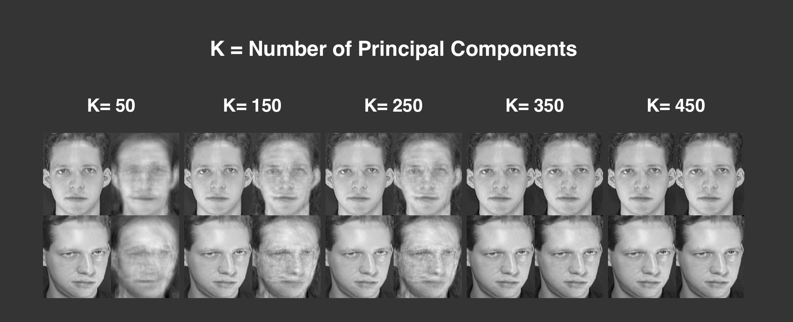

# Principle Component Analysis
An implementation of Principle Component Analysis for compression of facial images.

## Introduction
Using the [ORL Database of Faces](http://www.cl.cam.ac.uk/research/dtg/attarchive/facedatabase.html) from Cambridge University, the motivation of this notebook is to examine the mathematical concepts underlying Principal Component Analysis for effective compression of facial images, known as 'eigenfaces'.

## About PCA
PCA is a dimensionality reduction technique used for pattern idetification in high-dimensional data by projecting it on a smaller dimensional subspace, while retaining most of its information. For instance, we may be given a dataset with  xixi  and  xjxj  attributes, where one is the size of a house in square feet and the other is the size in square metres. PCA automatically detects and remove these linearly dependent attributes by projecting the dataset on a smaller dimensional subspace. In addition, using PCA allows us to reduce our data to 2 or 3 dimensions for visualisation.

#### Visualisation of Reconstructed Facial Images across different K Values.

## Requirements
* python3
* numpy
* matplotlib
* opencv

## Usage
Run `jupyter notebook` in your Python 3 environment

## References
1. [Dimensionality Reduction](https://github.com/llSourcell/Dimensionality_Reduction) by Siraj Raval
2. [CS229: Principal Component Analysis](http://cs229.stanford.edu/notes/cs229-notes10.pdf) by Andrew Ng
3. [Dimensionality Reduction](https://www.google.com.sg/url?sa=t&rct=j&q=&esrc=s&source=web&cd=2&cad=rja&uact=8&sqi=2&ved=0ahUKEwi91O-cxJbVAhXKfrwKHcMhDjsQFggqMAE&url=https%3A%2F%2Fcourses.cs.washington.edu%2Fcourses%2Fcsep546%2F16sp%2Fslides%2FPCA_csep546.pdf&usg=AFQjCNHBTWpCQA7w_4Lbq3lutbSrsFjHdw) by Fereshteh Sadeghi
4. [Discussion on PCA and SVD](https://stats.stackexchange.com/questions/134282/relationship-between-svd-and-pca-how-to-use-svd-to-perform-pca) from Stack Exchange